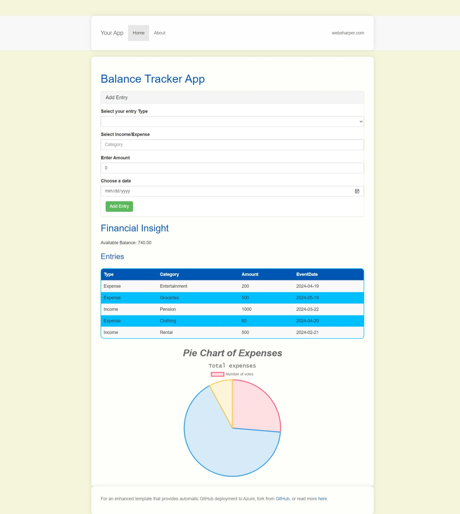

#Balnce Tracker App with F#

This is a balnce tracker app that tracks balance. You are supposed to enter income or expense and fill in the other details as well and it gives you the balance. It also shows you the pie chart of your expenses. 
## Sample Images



## Technologies used


- [F#](https://fsharp.org)
- [WebSharper](https://websharper.com)
- [ASP.NET Core](https://dotnet.microsoft.com/en-us/apps/aspnet)

## Preview

You can see a live preview of the website [here](https://omg775.github.io/BalanceTracker).

## Project Architecture 

- **Client.fs**: contains the client-side code including all logic and functionality 
- **wwwroot/index.html**: The main HTML file using websharper templating
- **wwwroot/styles.css**: Styles for the page.


## Getting Started

To get a local copy up and running follow these simple steps.

### Prerequisites

Before you start, ensure you have the following installed:

- Aleast version6 of [.NET Core SDK](https://dotnet.microsoft.com/download)
- [Node.js](https://nodejs.org/)
- npm 

### Installation

1. Clone the repo
```sh
git clone https://github.com/omg775/BalanceTracker.git
```
2. Navigate to the project directory
```sh
cd Asssignment2
```

3. Build the project using the following command:
```sh
dotnet build
```

4. Run the project:
```sh
dotnet run
```
5. Open your web browser and navigate to [https://localhost:64371/](https://localhost:64371/) to view the application.
